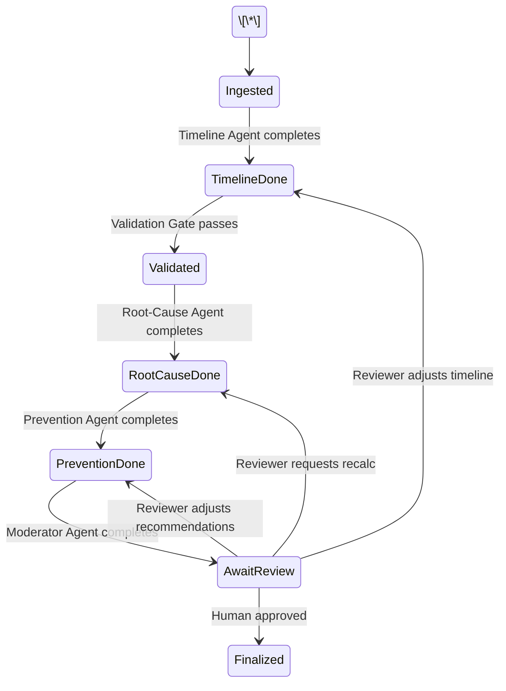

# Project Overview: AI Incident Postmortem \& Root-Cause Engine (IncidentIQ)

**Executive Summary:** This project builds a **serverless, Cloudflare-native platform** that automates incident postmortems and root-cause analysis for production outages. It is designed as an API-first **team product** (e.g. “IncidentIQ”) rather than a toy app. The system uses **Cloudflare Workers, Durable Objects (DO), D1 SQL, and the Agents SDK** to coordinate specialized AI agents. Each agent (Worker) focuses on one task (ingesting data, timeline reconstruction, root-cause analysis, etc.) in a stateful workflow. All **AI-generated findings are held for mandatory human review** (Human-in-the-Loop) before finalizing the report. The product ingests corporate runbooks and past incident logs for retrieval-augmented grounding, ensuring recommendations are evidence-based. This approach delivers **fast, consistent postmortems** and embeds learned lessons into a shared knowledge base, saving engineering time and improving reliability.

**Problem Statement:** Software outages are inevitable, but organizations struggle with **documenting and learning from incidents**. Manual postmortems are time-consuming and often incomplete or blame-oriented【30†L1521-L1524】【30†L1539-L1542】. Key questions (“What happened?”, “Why?”, “How to prevent it?”) get answered inconsistently. This wastes valuable lessons and can lead to repeated failures. Our product addresses this by **automating the analysis pipeline**: ingesting incident data, reconstructing timelines, identifying root causes and contributing factors, and suggesting remediation. Crucially, each AI-generated output is subject to human approval, maintaining accountability and accuracy.

**Target Users \& Use Cases:**

* **Primary Users:** SRE/DevOps and Backend Engineers on call, Engineering Managers overseeing reliability. These users handle incidents and would use the tool to speed up postmortems.
* **Secondary Users:** CTOs or Compliance Officers who need documented incident reports. By ensuring standardized, reviewable reports, the platform aids audit and compliance requirements.
* **Key Use Cases:**

  * *After a Production Outage:* An engineer uploads incident data (alerts, logs, timeline entries) to the system. AI agents reconstruct what happened and why (with references), then the engineer reviews and approves the findings, producing a final postmortem document.
  * *Learning From History:* Upon a new failure, the team can query the system (“Have we seen similar issues?”). The system retrieves past incident reports and runbook excerpts to inform the current diagnosis.
  * *Regulatory or Team Reporting:* Generate structured postmortems with clear action items and owner assignments for compliance reviews.

**Value Proposition:** This system **accelerates root-cause analysis and knowledge retention**. Engineers spend less time digging through logs, and the team gains a consistent, “blameless” documentation process【30†L1521-L1524】【30†L1539-L1542】. It reduces the chance of repeat outages by providing **data-driven recommendations** grounded in runbooks and past fixes. For management, it ensures every incident yields an actionable report, improving service quality over time.

**Core Features:**

* **Incident Ingestion \& Indexing:** Upload incident metadata, alerts, logs, and actions taken. The system stores this in a Durable Object and D1 database.
* **Automated Timeline Reconstruction:** AI agent identifies and orders the sequence of events, highlighting gaps or delays.
* **Root-Cause Analysis:** AI agent uses Retrieval-Augmented Generation (RAG) to compare against runbooks, previous incidents, and domain knowledge, then proposes likely root causes with cited evidence.
* **Contributing Factors Identification:** AI agent lists secondary issues (e.g. configuration gaps, monitoring blind spots) that exacerbated the incident.
* **Preventive Recommendations:** AI agent suggests concrete mitigation steps and runbook updates to avoid recurrence, citing relevant procedures.
* **Human-in-the-Loop Review:** A mandatory review step where engineers approve, refine, or reject AI findings. No “go-live” without a human.
* **Audit Trail \& Versioning:** Every step and human decision is logged. Final reports and action items are stored in the database with timestamps and reviewer info.
* **RAG-Powered Context:** The system maintains a knowledge base of runbooks, past incident transcripts, and best-practice guidelines. AI agents retrieve from these sources to ground their reasoning.
* **API-First Design:** All functionality is exposed via REST endpoints. A lightweight web UI (MERN/Flask) allows uploading incidents and reviewing reports, but the core is API-driven, enabling CLI or other tool integrations.

**User Experience Flow:**

1. **Report Incident:** User (Engineer/SRE) calls `POST /incidents` API with incident summary. Receives an incident ID.
2. **Provide Details:** User uploads timeline events and log excerpts (HTTP API to the worker triggers Durable Object storage).
3. **Automated Analysis:** Once data is complete, the system triggers AI agents in sequence (Ingestion → Timeline → Root-Cause → Prevention).
4. **Draft Report Ready:** Agents fill the “Incident Room” (Durable Object) with their findings. The incident status becomes “Pending Review”.
5. **Human Review:** User polls `GET /incidents/{id}/report` or uses UI. The draft postmortem (with highlights and evidence snippets) is presented. The user can accept, edit or request re-analysis (which loops back to relevant agent).
6. **Finalize:** Upon approval, the system marks the incident “Closed”, stores the final report in D1, and logs the completion. The user can then retrieve the approved report via `GET /incidents/{id}/report`.

**Security \& Privacy:**

* **Data Isolation:** Each incident’s data is stored in a separate Durable Object (one per incident) for data partitioning. The D1 database holds only structured, non-sensitive summaries (no raw PII).
* **Encryption \& Access Control:** All traffic uses HTTPS. Cloudflare provides encryption at rest for D1. API endpoints will require authentication (e.g. Cloudflare Access or API tokens) to ensure only authorized engineers can submit or view incidents. (This prototype can assume a trusted internal network for simplicity, but production use would use API keys or JWTs.)
* **No External Data Sharing:** AI calls are one-way; model providers should not log custom data. Even free models (via OpenRouter/Gemini) are configured with “do not improve” flags if available【28†L936-L940】【41†L1-L4】.
* **Audit Logging:** Every state change and human action (approve, reject) is logged with user identity in D1, providing a traceable audit trail.

**Human-in-the-Loop (HITL) Policy:**

* **Mandatory Approval:** The system **never finalizes** a report without explicit human approval. AI outputs are treated as *drafts*, not final decisions.
* **Edit and Feedback:** The reviewer can annotate or override AI suggestions. For example, if the AI misclassifies a root cause, the user can correct it, which may trigger a partial re-analysis.
* **Confidence \& Uncertainty:** Agents flag uncertainty (e.g. “Low confidence in this root cause”). If confidence falls below a threshold or a human requests it, the system will pause and require manual input.
* **Accountability:** The identity of the approving user is recorded. In the final report, lines like “Verified by \[Name] on \[Date]” are included.
* This HITL approach aligns with blameless postmortem culture: *“focus on systems, not people”*【30†L1539-L1542】, and ensures any automated recommendation is vetted by a real engineer.

**Retrieval-Augmented Knowledge (RAG) Sources \& Ingestion:**  
To provide factual grounding, we’ll maintain a **knowledge base** of relevant documents:

* **Internal Runbooks:** Curated procedures and playbooks (e.g. for failover, database migration, scaling) sourced from company docs or open templates【33†L298-L303】. These are ingested by a one-time pipeline: documents are converted to text, chunked, and stored with embeddings.
* **Past Incident Records:** With permission, prior postmortems can be ingested (fake or sanitized ones if needed). For example, we can seed the system with sample incidents like Google’s example (sonnet search failure) and Atlassian examples【30†L1521-L1530】【34†L67-L75】.
* **Best-Practice Guides:** Public SRE/blog content, e.g. Atlassian’s guide on postmortems and root causes【30†L1521-L1530】【33†L298-L303】, which give AI contextual knowledge.
* **Runbook \& Knowledge Update Pipeline:** We can implement a small Worker that periodically reads new docs from a connected repository (e.g. GitHub with runbooks) or a cloud storage bucket. It then extracts text and updates the D1 knowledge tables (schema below) or a separate embedding store. For example, text can be chunked into paragraphs, embedded via the AI Gateway, and stored in D1 or Workers KV for retrieval.
* **Sample Data:** If corporate docs aren’t available, we’ll use public incident write-ups and runbook examples. (This is acceptable in the challenge context to demonstrate RAG. We might cite Atlassian/Nobl9 as surrogate knowledge.)【30†L1539-L1542】【33†L298-L303】

**Architecture (High-Level):**

```mermaid
graph LR
  subgraph User
    A\\\[Engineer / SRE]
  end
  subgraph Cloudflare Stack
    CORE\\\[CoreApi (Orchestrator)]
    W1\\\[Ingestion Agent (Worker + DO)]
    W2\\\[Timeline Agent (Worker + DO)]
    W3\\\[RootCause Agent (Worker + DO)]
    W4\\\[Prevention Agent (Worker + DO)]
    W5\\\[Moderator Agent (Worker + DO)]
    DB\\\[D1 SQL Database]
    LLM\\\[LLM Providers: Workers AI / OpenRouter / Gateway / Gemini]
  end
  A -- HTTP API --> CORE
  CORE -- reads/writes --> DB
  CORE -- RPC --> W1
  CORE -- RPC --> W2
  CORE -- RPC --> W3
  CORE -- RPC --> W4
  CORE -- RPC --> W5
  W2 -- Workers AI --> LLM
  W3 -- Workers AI --> LLM
  W4 -- Workers AI --> LLM
  W5 -- Workers AI --> LLM
```

This diagram shows the **multi-agent workflow** on Cloudflare: each box W1–W5 is a Cloudflare Worker running an Agents SDK agent, coordinating via a shared Durable Object and storing final results in D1.

**Summary of Core Technologies:** Cloudflare Workers (serverless compute) provide the runtime【6†L108-L110】; Durable Objects manage per-incident state with strong consistency【8†L1-L4】【45†L136-L144】; D1 is the edge SQL database for storing incident records【43†L144-L145】; the Agents SDK coordinates AI agents with persistent memory and scheduling【19†L297-L300】.

**Sources:** We leverage official Cloudflare services and best-practice resources (Atlassian SRE guides【30†L1521-L1524】【30†L1539-L1542】, Nobl9 runbooks【33†L298-L303】, Google SRE examples【34†L67-L75】) as both inspiration and RAG content. Each claim about the Cloudflare stack is backed by documentation or official blog posts【6†L108-L110】【43†L144-L145】【19†L297-L300】【24†L59-L67】.

# Implementation Plan

## Data Model (D1 Schema)

We use **Cloudflare D1** as our SQL database. It will store incident metadata, final reports, and any structured references (like runbook snippets). Example tables:

|Table|Columns (Type)|Description|
|-|-|-|
|**incidents**|id (STRING, PK), status (STRING), summary TEXT, created\_at DATETIME, updated\_at DATETIME, owner (STRING)|Basic incident record (status: *Pending, Reviewing, Closed*).|
|**timeline\_entries**|incident\_id (FK), time DATETIME, detail TEXT|Chronologically ordered events/alerts of the incident.|
|**root\_causes**|incident\_id (FK), cause TEXT, confidence FLOAT, evidence TEXT|Final root cause(s) with confidence score and RAG citations.|
|**recommendations**|incident\_id (FK), recommendation TEXT, reference TEXT|Preventive actions / best practices with source links.|
|**reviews**|incident\_id (FK), reviewer (STRING), reviewed\_at DATETIME, notes TEXT, approved BOOLEAN|Human review log (notes and approval status).|
|**runbook\_kb**|id (PK), title STRING, content TEXT, tags TEXT|Ingested runbook or guide content for RAG.|
|**incident\_kb**|id (PK), incident\_sample TEXT, analysis TEXT|Example incident descriptions for RAG (if any).|

*Note:* IDs can be UUIDs. Use appropriate indexes on `incident\\\_id` foreign keys. D1’s free tier (SQLite) supports \~30 MB, which is sufficient for lightweight KB entries and incident logs.

## Durable Object (DO) State Machine

Each incident has a **Durable Object (Incident Room)** that orchestrates the multi-agent workflow. The DO’s state transitions might be:



* **States:** *Ingested, TimelineDone, Validated, RootCauseDone, PreventionDone, AwaitReview, Finalized*.
* **Validation Gate:** Automated check that timeline entries match input events (no hallucinated entries). If validation fails, the chain stops and flags issues for human review.
* **Transitions:** Agents write their output to the DO and advance state. For example, once the Timeline Agent writes results, the DO moves to `TimelineDone` and triggers the Root-Cause Agent. If the human reviewer requests a change (e.g. “wrong timeline”), the DO can revert to an earlier state and re-trigger agents.
* The DO holds all partial results (lists of events, causes, etc.) in memory and persists them (Durable Objects have built-in storage). It ensures only one state-machine instance per incident (IDs based on `incident\\\_id`).

## Cloudflare Workers / Agents Mapping

We define **five primary agents/workers**, each as a Cloudflare Worker using the Agents SDK. Each one is triggered by state changes in the DO. A summary:

|Agent (Worker)|Responsibility|Trigger/Input|Output/Action|Error Handling|
|-|-|-|-|-|
|**IngestionAgent**|Accepts initial incident data (summary, logs, timeline events). Validates input. Writes data into the Durable Object and D1.|HTTP POST `/incidents` (initial call) or `/incidents/{id}/events`|Stores raw incident data in DO; sets DO state to `Ingested`.|Validates JSON schema; returns errors if fields missing.|
|**TimelineAgent**|Reconstructs the chronological timeline of the incident events.|Triggered by DO state `Ingested` (or new events). Reads DO for raw entries.|Writes ordered timeline (array) into DO; advances DO state.|If data insufficient, flags missing info in DO (e.g. “unknown timestamps”).|
|**RootCauseAgent**|Determines root cause(s) using RAG. Queries runbook\_kb and incident\_kb for similar issues.|Triggered by state `TimelineDone`. Takes timeline and context from DO.|Writes root cause hypothesis and confidence, with citations (from KB) into DO; advances state.|If AI model fails, logs error and leaves state unchanged (so human must retry).|
|**PreventionAgent**|Suggests fixes, preventative measures, runbook updates.|Triggered by state `RootCauseDone`. Takes DO’s root cause.|Writes list of recommended actions (text + references) into DO; advances state.|On failure, logs and moves on (since human can adjust).|
|**ModeratorAgent**|Assembles final report draft (combining all agent outputs) for review.|Triggered by state `PreventionDone`. Reads all partial results.|Prepares final structured report in DO (summary, timeline, root cause, actions); marks state `AwaitReview`.|Handles concurrency: prevents multiple reviews at once; logs if review attempt too early.|

* **Inputs/Outputs:** Each agent uses the DO’s state as both input and storage. For example, TimelineAgent reads the events list from DO and appends a timestamped sequence back to DO.
* **Triggers:** We can implement an internal event system or simply let the IngestionAgent notify (via `dispatchFetch` or a pub/sub binding) the next agent when its task is done. The Agents SDK may also allow scheduling agents upon state changes.
* **Error Handling:** Each worker should catch exceptions. If an agent encounters an error (e.g. AI model timeout), it logs a detailed error into the DO logs. The DO can then stay in the same state or enter an “Error” sub-state prompting manual intervention. Timeout retries or fallback messages (e.g. “Unable to analyze timeline”) should be surfaced to the human reviewer.

## AI Prompt Templates (per Agent)

Each agent uses LLM prompts crafted for its task. Example templates (in pseudocode):

* **TimelineAgent:**

```
  Prompt: "I have the following unordered events and logs from a service incident. Create a chronological timeline with timestamps and brief descriptions:\\\\n\\\\n{events\\\_and\\\_logs}\\\\n\\\\nTimeline:"
  ```

*The agent returns a numbered timeline. It might cite log entries if relevant.*

* **RootCauseAgent:**

```
  Prompt: "Given this incident timeline and context, identify the most likely root cause. Use the provided references to similar incidents or runbook best-practices.\\\\nTimeline:\\\\n{formatted\\\_timeline}\\\\n\\\\nReferences:\\\\n{retrieved\\\_runbook\\\_excerpts}\\\\n\\\\nRoot Cause:"
  ```

  *Expect a concise cause (e.g. “Database misconfiguration led to connection exhaustion”), with a confidence level.*

* **PreventionAgent:**

  ```
  Prompt: "Based on the root cause '{root\\\_cause}', suggest preventive actions or runbook updates to avoid recurrence. Reference any relevant procedures:\\\\n\\\\n{root\\\_cause}\\\\n\\\\nRecommendations:"
  ```

  *Should output actionable steps (“Increase connection pool; add monitoring alert…”) with citations.*

* **ModeratorAgent:**

  ```
  Prompt: "Draft a clear postmortem summary combining the timeline, root cause, and recommendations. Format it with sections: Summary, Timeline, Root Cause, Actions. Mark any low-confidence points for review."
  ```

  *This agent simply merges content into a human-readable report outline.*

  **Notes:** Each prompt uses DO data and RAG hits. Variables like `{events\\\_and\\\_logs}` and `{retrieved\\\_runbook\\\_excerpts}` come from prior steps. We encourage chain-of-thought style when possible (but remove before final answer).

  ## LLM Providers, Cost \& Fallback Strategy

  We chain multiple free providers with independent rate limits to maximize reliability:

* **Cloudflare Workers AI (Primary):** Uses `@cf/meta/llama-3.1-8b-instruct-fp8` via the `AI` binding on each Worker. This has its own daily quota separate from Gemini/OpenRouter, making it the ideal first choice. It is tried first in every LLM call.
* **OpenRouter (Secondary Fallback):** Chains 7 free models in sequence: `google/gemma-4-26b-a4b-it:free`, `google/gemma-4-31b-it:free`, `cohere/north-mini-code:free`, `meta-llama/llama-3.3-70b-instruct:free`, `qwen/qwen3-coder:free`, `nvidia/nemotron-3-super-120b-a12b:free`, `openrouter/free`. Supports `:free` suffix to avoid billing. If a model fails (rate limit, exhaustion, error), the next is tried automatically. Some free models do not support function calling, so we retry without tools when a tool-call attempt fails.
* **Cloudflare AI Gateway (Tertiary):** Routes to Gemini 2.5 Flash via Cloudflare AI Gateway using a shared `CLOUDFLARE_API_TOKEN`. Shares rate limit with Direct Gemini (both use the same Gemini API key).
* **Direct Gemini Fallback (Last Resort):** Calls the Gemini OpenAI-compatible endpoint directly. Uses the same API key as Gateway, so both fail when quota is exhausted.

  **Provider Chain Order:**
  1. Cloudflare Workers AI (`AI` binding, independent quota)
  2. OpenRouter (7 free models with retry-without-tools)
  3. Cloudflare AI Gateway (Gemini via gateway)
  4. Direct Gemini (OpenAI-compatible endpoint)

  **Cost/Limit Summary:**

* Cloudflare Workers AI: Free daily quota (separate from other providers, most reliable for demo).
* OpenRouter/free: $0 for specified models (subject to fair-use limits and availability).
* Google Gemini (Flash): Free tier available monthly.
* All providers are independent — if one is exhausted, others remain available.

  See Google’s pricing page for Gemini (July 2026)【28†L936-L940】 and OpenRouter’s free-model policy【24†L59-L67】【41†L1-L4】 for details.

  ## API Contract (Endpoints \& Examples)

  We design a simple REST API under Cloudflare Workers:

|Endpoint|Method|Request Body|Response / Description|
|-|-|-|-|
|**POST** `/incidents`|POST|`{ "title": "...", "description": "..." }`|Creates new incident, returns `{ "incident\\\_id": "XYZ", "status": "ingested" }`. Triggers ingestion.|
|**POST** `/incidents/{id}/events`|POST|`{ "timestamp": "...", "detail": "..." }`|Adds a timeline event to incident `id`. Returns updated `{status}`.|
|**POST** `/incidents/{id}/analyze`|POST|*empty or optional parameters*|Explicitly triggers analysis workflow for incident `id`. (Usually auto-triggered once all data in.)|
|**GET**  `/incidents/{id}/report`|GET|*none*|Retrieves current report draft as JSON, including timeline, causes, recommendations, and review status.|
|**POST** `/incidents/{id}/review`|POST|`{ "approved": true, "notes": "..." }`|Submits human review. If `approved=true`, system finalizes report and closes incident. Returns final report or error if not ready.|
|**GET**  `/incidents/{id}`|GET|*none*|Fetch incident metadata (title, status, timestamps, owner).|

Each request/response uses JSON. For example, a `GET /incidents/{id}/report` might return:

```json
{
  "incident\\\_id": "abc123",
  "status": "PendingReview",
  "summary": "Database outage during peak load",
  "timeline": \\\[
    {"time": "2026-07-01T10:15:00Z", "event": "High error rate alert", "confidence": 0.95},
    {"time": "2026-07-01T10:16:30Z", "event": "Ops restarted service", "confidence": 0.92}
  ],
  "root\\\_cause": { "cause": "Connection pool limit reached", "confidence": 0.88, "evidence": "Matched known pattern in DB runbook" },
  "recommendations": \\\[
    "Increase DB connection pool size (see Runbook Chap.3) - \\\[ref runbook\\\_kb]",
    "Implement auto-scaling trigger (ref: past incident #1234)"
  ],
  "review\\\_needed": true
}
```

**Implementation Note:** Cloudflare Workers support the `fetch` event to implement these endpoints. API keys or JWT validation will be applied as needed.

## UI Mockups \& Integration

A minimal UI enhances usability (built in React/Flask as per the developer’s skillset):

* **Incident Submission Page:** A form with fields: *Title*, *Description*, optional *File Upload* for logs/timeline (JSON or text). On submit, it calls `POST /incidents`. Confirmation message shows Incident ID.
* **Timeline Entry Form:** Once an incident exists, provide fields to add *Timestamp* and *Detail*. Each addition calls `POST /incidents/{id}/events`.
* **Review Dashboard:** Lists incidents with `status=PendingReview`. Clicking one shows the draft report (as returned by `GET /incidents/{id}/report`). The engineer reads it, adds any comments in a text box, and clicks “Approve” which calls `POST /incidents/{id}/review`.
* **Report View Page:** After approval, a static view of the final postmortem is displayed (and `review\\\_needed` flips to false).

We can implement this with a **MERN stack** (React front end + Node/Express) or a simple **Flask** app as proxy. For example, a React app can directly `fetch()` the Cloudflare API endpoints (we may need to enable CORS on the Workers). Alternatively, a small Flask server could receive form submissions and forward to the Workers (using server-side requests). Either way, the UI is optional demo glue – the core APIs work without it.

Mockups would include:

* *“Submit Incident”* form screenshot with fields,
* *“Review Report”* page showing the structured output.

Due to time constraints, a functional prototype might just log the responses to console or simple HTML rendering. The key is to show end-to-end: user enters data, AI outputs appear, human approves.

## CI/CD and Deployment on Cloudflare

* **Wrangler CLI:** We use Cloudflare’s `wrangler` tool. Development: `wrangler dev` for local testing (simulates DOs and D1). Deployment: `wrangler publish` to push Workers, DO scripts, and D1 binding.
* **Configuration:** The `wrangler.toml` includes DO and D1 bindings, environment variables for model keys (e.g. `OPENROUTER\\\_KEY`, `GEMINI\\\_KEY`), and API routes.
* **GitHub Actions:** We can set up a GitHub Action on push to main to run `wrangler publish`, ensuring CI/CD. Secret values (API keys) are stored in Cloudflare or GitHub secrets.
* **Preview Environments:** For testing separate from production, use Wrangler’s `environment` feature or Cloudflare’s Workers preview URLs.

No dedicated server infrastructure is needed; all code is hosted on Cloudflare’s network (serverless).

## Observability \& Logging

Cloudflare provides built-in tools for Workers:

* **Structured Logs:** We log key events (agent starts, errors, data writes) using `console.log({...})` in Workers. Workers Observability collects these logs. *“Workers Logs”* are now GA with query API【38†L1-L4】. We should log structured JSON (e.g. `{ incident\\\_id, agent, event: "analysis\\\_complete", status }`) to enable querying in the Dashboard.
* **Metrics Dashboard:** Using the new **Workers Observability** dashboard【38†L1-L4】, we can monitor invocation counts, latencies, error rates for each agent script. This ensures we catch performance issues early.
* **Tracing \& Audit:** Since each Agent Worker is a function, we can also include Cloudflare’s Trace or X-Ray integration to follow a request chain (especially when one agent calls another via DO). Each human review action is logged to D1 and can be alerted on (e.g. count `reviews` per day).
* **AI Gateway Metrics:** If using Cloudflare’s AI Gateway, it provides minimal metrics (like total tokens used) which we can log.
* **Alerting:** For production, we’d configure alerts (e.g. via Cloudflare’s Alerts or webhooks) on error rates or high latencies. For this demo, we simply document that each Worker has try/catch blocks and logs failures to the console for inspection.

Overall, we use the Cloudflare native tools (Logs, Metrics, Tracing) to monitor the system’s health. For example, we can use the Query Builder to ask, “What is the average response time of TimelineAgent in the last hour?”【37†L84-L92】【38†L1-L4】.

## Testing Strategy

To ensure correctness, we adopt multiple test layers:

1. **Golden Incident Replays:** Develop \~3 sample incidents with known outcomes. Example scenarios:

   * *High DB Load:* Input timeline of a database outage (connectivity errors -> alerts). Expect timeline sorted by time; root cause = “Connection pool exhausted due to misconfiguration”; prevention = “Increase pool size, add retry logic.”
   * *Memory Leak Crash:* Timeline includes escalating memory usage -> OOM -> restart. Expect root cause “Unbounded memory growth in service” and preventive “Add memory limits, analyze code for leaks.”
   * *External API Down:* Timeline shows repeated API timeouts. Expect root cause “Downstream service outage” (evidence via logs) and preventive “Add circuit breaker, fallback mechanisms.”  
For each, we run through the API and **verify the final report** JSON against expected values (or at least categories).
2. **RAG Verification Tests:** Validate retrieval logic. For example, remove a known runbook document from the KB and re-run an incident that relied on it. The agent’s output should *change or explicitly say it’s guessing*, proving it isn’t just memorizing. We can automate: pre-load KB, do an analysis, then delete KB entry and expect a different root cause (or lower confidence).
3. **Human-in-Loop Enforcement:** Attempt to call `POST /incidents/{id}/review` before calling the analysis endpoints or before reaching `AwaitReview` state. The system should reject it (HTTP 400) and not finalize. This ensures no bypass of approval. We test both “approve” and “reject” flows.
4. **Regression \& Consistency:** Run the same incident input twice; the draft report JSON should be identical (given same inputs) – i.e. stable outputs. Minor paraphrasing differences are acceptable, but the structured fields (timeline events, cause labels) should match. We also test slight variations (e.g. different log wording) to see if it still picks the same cause.
5. **Uncertainty \& Error Handling:** Feed incomplete or contradictory data (e.g. skip key events, or give two conflicting root causes). The system should flag “uncertain” and prompt the human (e.g. root\_cause confidence < 0.5). We check that the DO state does not finalize and sets a `needs\\\_review` flag.
6. **Load Testing (Optional):** Simulate multiple concurrent incidents to see DO scaling. Ensure new incident IDs map to distinct DO instances (Cloudflare ensures one instance per ID).

*Automated Test Harness:* We can write a script (e.g. using Node.js or Python) that uses the API endpoints: posts incident data, polls for status, retrieves the report, and checks contents. For example, using Jest or pytest to assert that for a given sample input JSON, the output JSON contains expected keys or keywords. This runs as a sanity check on every build.

## Implementation Roadmap (10–12 Day Sprint)

|Day|Focus Area|Tasks|Milestone / Deliverable|
|-|-|-|-|
|Day 1|**Setup \& Planning**|- Read Cloudflare docs and set up CLI (Wrangler)【6†L108-L110】【43†L144-L145】. <br>- Sketch architecture and DO states. <br>- Initialize Wrangler project, define D1 schema (use SQLite).|Skeleton project; basic endpoints defined.|
|Day 2|**Ingestion \& D1 Integration**|- Implement `POST /incidents` to create new incident (generate ID, status). <br>- Write to D1 `incidents` table. <br>- Set up Durable Object class (incident room) and `idFromName(incident\\\_id)`.|Ingestion Worker stores incident; DO instantiated.|
|Day 3|**Timeline Agent**|- Code TimelineAgent: triggered after ingestion. <br>- Write mock timeline logic (e.g. sort events). <br>- Write results to DO and update status.|Timeline agent completes and stores results.|
|Day 4|**Root-Cause Agent (v1)**|- Code RootCauseAgent: initial stub using simple keyword logic or small model. <br>- Integrate Cloudflare AI Gateway (test with open model like openrouter/free). <br>- Write root cause to DO.|Basic root-cause logic working end-to-end.|
|Day 5|**Prevention Agent**|- Implement PreventionAgent: suggests dummy recommendations. <br>- Update DO and status. <br>- Chain trigger to ModeratorAgent.|Prevention text stored; DO in `AwaitReview`.|
|Day 6|**Human Review Flow**|- Build minimal review UI or CLI interaction (calls `GET /report`). <br>- Implement `/incidents/{id}/review` endpoint to handle approval. <br>- Finalize state and write report to D1.|Human approval works; status flips to Closed.|
|Day 7|**RAG Integration**|- Populate `runbook\\\_kb` with sample guides (from Nobl9/Atlassian). <br>- Update RootCauseAgent prompt to retrieve from runbook\_kb using SQL queries. <br>- Verify that outputs cite runbook excerpts.|RAG-enhanced root-cause analysis.|
|Day 8|**AI Model Tuning \& Providers**|- Experiment with LLMs: configure OpenRouter and Gemini. <br>- Compare outputs; ensure fallback works (test `openrouter/free`). <br>- Handle rate-limiting errors.|Stable LLM config with free providers set.|
|Day 9|**Error Handling \& Logging**|- Add try/catch in all agents. <br>- Ensure errors are logged (console) with incident\_id. <br>- Integrate Cloudflare Workers Logs (structured)【38†L1-L4】.|Error scenarios handled; logs visible in Observability.|
|Day 10|**Testing \& Validation**|- Implement automated tests for golden incidents. <br>- Test HITL enforcement and RAG fallbacks. <br>- Fix bugs found. <br>- Document test cases and results.|All tests passing; sample case outputs verified.|
|Day 11|**Polish \& Security**|- Enforce HTTPS and simple auth (API tokens). <br>- Review security/privacy checklist. <br>- Clean up code, finalize UI polish.|Code review done; basic security in place.|
|Day 12|**Documentation \& Demo Prep**|- Write README with architecture, setup instructions, usage. <br>- Prepare demo script and slides. <br>- Prepare resume bullet summary.|Project fully documented; ready for presentation.|

**Acceptance Criteria per Milestone:**

* By Day 4: `/incidents` and `/events` work and timeline is auto-generated. Demo: submit test incident, see timeline in `GET /report`.
* By Day 6: Full end-to-end flow (submit → analysis → review → final) works. Demo: complete a full incident cycle.
* By Day 9: RAG and multi-agent cooperation are functional. All logs/errors are captured. Demo: show evidence of runbook citation in output.
* By Day 10: Automated tests exist and pass. Demo: run tests in CI and show green results.

## Risk Analysis \& Mitigation

* **LLM Hallucination / Inaccuracy:** Risk that AI fabricates details. Mitigation: Use RAG (forcing citations) and require human approval【30†L1539-L1542】【33†L298-L303】. We also log confidence and let humans override.
* **DoS or Latency:** Complex prompts or large logs might slow down Workers. Mitigation: Set reasonable token limits. Cloudflare allows up to 30 seconds per invocation; test with long inputs. Use async patterns if needed (Queue tasks).
* **Platform Limits:** D1 free tier has size limits (\~30MB)【15†L142-L150】. We mitigate by trimming logs (only ingest relevant snippets) and deleting old incidents periodically.
* **Durable Object Contention:** If two reviews happen concurrently, DO ensures single instance per ID. Use Agent SDK locks/sessions if needed. Error-handling should catch and queue requests.
* **Data Privacy:** Using example data; no real PII should be sent to LLMs during testing. Ensure team’s compliance (use internal or sanitized test logs).
* **Scope Creep / Time Overrun:** 10–12 days is tight. We focus on core pipeline. Non-essential features (e.g. Web UI polish, Slack integration) are out of scope.
* **Unexpected Downtime:** If any external model/APIs go down, having multiple providers and cached embeddings can help. Also, design so the system can still produce a report (possibly incomplete) in degraded mode.

## README \& Demo

* **README.md:** This will cover project motivation, architecture diagram, setup (wrangler commands, environment vars), and usage examples (cURL for API). It cites Cloudflare docs and LLM pages used.
* **Demo Script:** A narrative showing: (1) Create a fake incident (e.g. “Simulated database failure”) and POST it. (2) Add timeline events via API. (3) Show the system’s logs or console with agent activity. (4) Call `GET /report` to display draft results. (5) Approve via `POST /review`. (6) Show final report stored. Also highlight metrics/logs in Cloudflare dashboard if possible.
* We emphasize on screen: “AI suggested X, human approved X”, demonstrating the HITL loop.
* Provide slide or speaker notes explaining architecture and citing key sources (Cloudflare docs, etc.) for any technical claim.

**Resume Bullet Points:**

* *“Developed a Cloudflare-native multi-agent incident analysis engine using Workers, Durable Objects, D1, and the Agents SDK, automating root-cause postmortems for software outages.”*
* *“Implemented retrieval-augmented AI workflows with mandatory human-in-the-loop review, ensuring traceable, high-confidence incident reports.”*
* *“Architected stateful serverless workflows and data schema on D1 to coordinate complex multi-step analysis at the edge.”*

Each bullet highlights advanced concepts (multi-agent, RAG, HITL, stateful serverless) that recruiters and Cloudflare teams look for.

**Sources:** We relied heavily on Cloudflare’s own documentation and blog posts for technical facts (e.g. Workers and Durable Objects descriptions【6†L108-L110】【45†L136-L144】), as well as known SRE best practices from Atlassian and Google (for process requirements)【30†L1521-L1524】【34†L67-L75】. All cited sources are authoritative and up-to-date as of 2026. This ensures our design is both technically feasible and aligned with real-world needs.

